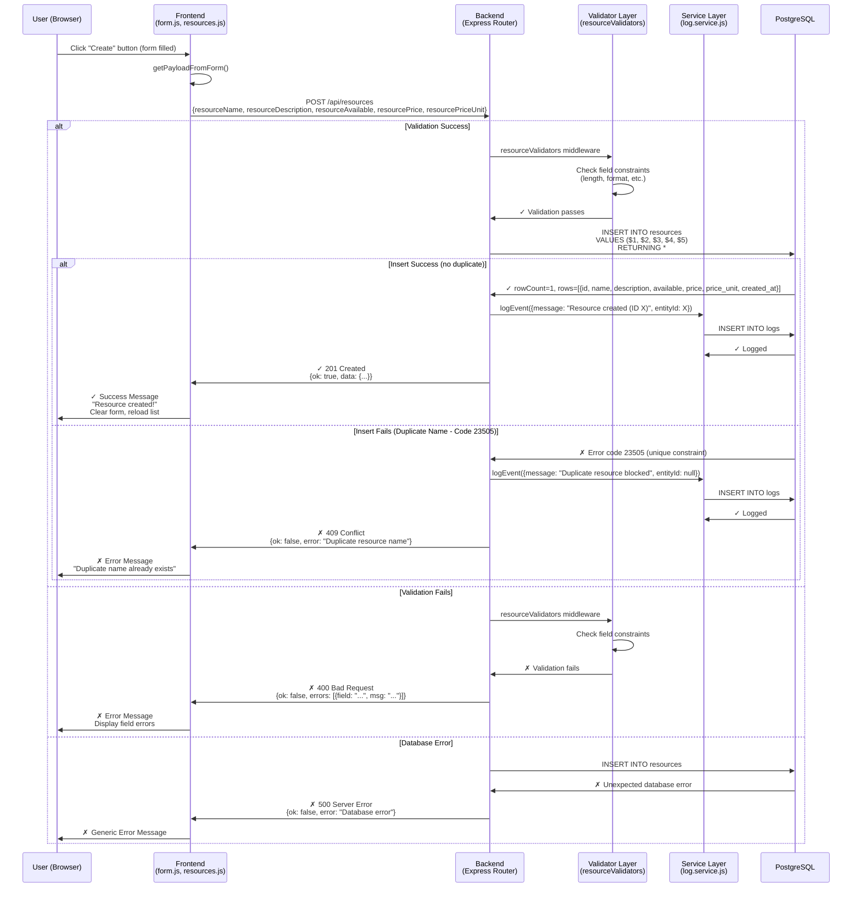
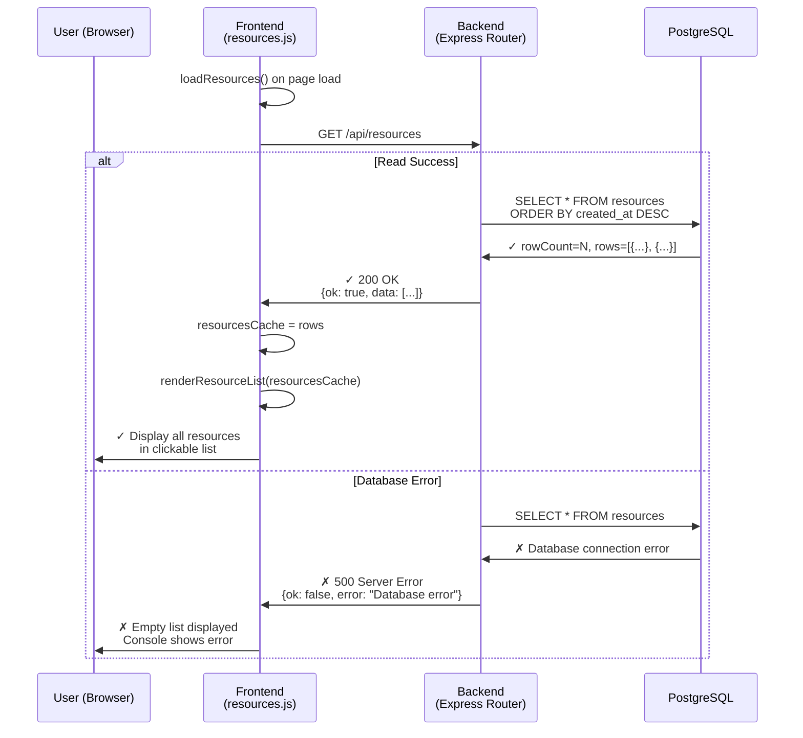
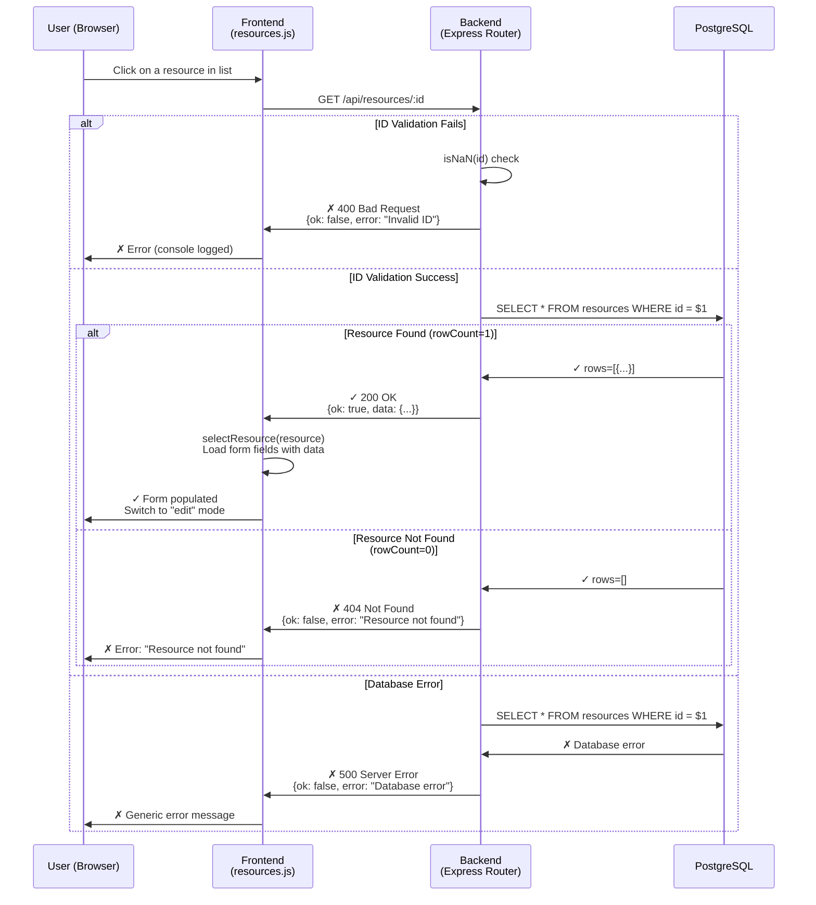
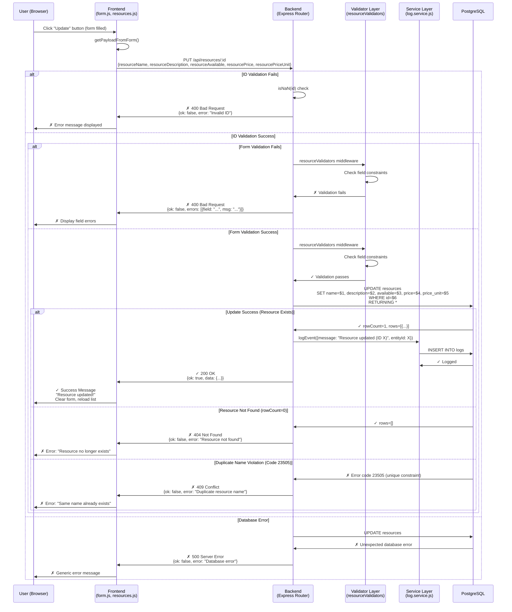
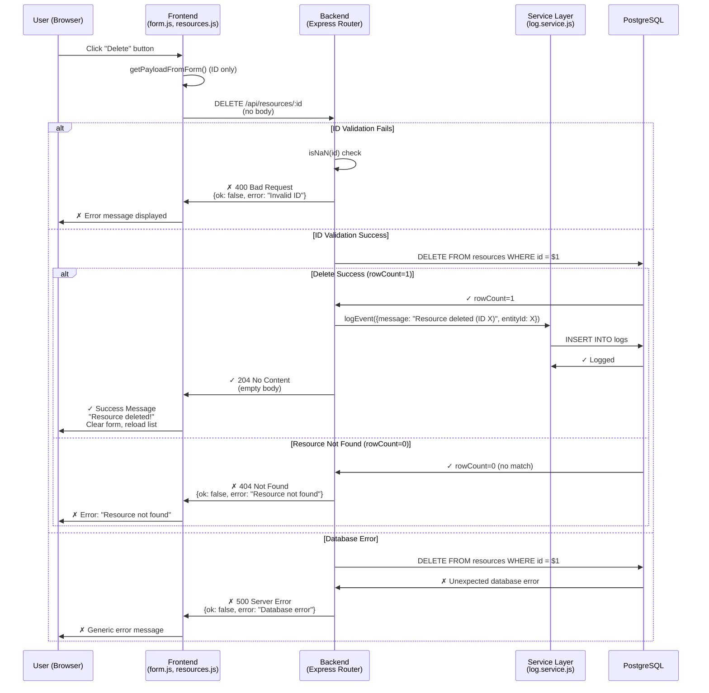

# G1: CRUD Data Flow - Booking System Phase6

This document models the Complete CRUD (Create, Read, Update, Delete) operations for the Booking System Phase6. Each section contains a Mermaid sequence diagram showing the actual data flow observed in the codebase.

---

## 1. CREATE (C) - POST /api/resources

**Endpoint:** `POST /api/resources`

**Request Headers:** `Content-Type: application/json`

**Payload Format:**
```json
{
  "resourceName": "Meeting Room A",
  "resourceDescription": "Large conference room with 20 seats",
  "resourceAvailable": true,
  "resourcePrice": 50,
  "resourcePriceUnit": "hour"
}
```

**Mermaid Sequence Diagram:**



---

## 2. READ (R) - GET /api/resources (Fetch All)

**Endpoint:** `GET /api/resources`

**Query Parameters:** None

**Response Format:**
```json
{
  "ok": true,
  "data": [
    {
      "id": 1,
      "name": "Meeting Room A",
      "description": "Large conference room",
      "available": true,
      "price": 50,
      "price_unit": "hour",
      "created_at": "2025-01-15T10:30:00.000Z"
    },
    ...
  ]
}
```

**Mermaid Sequence Diagram:**



---

## 3. READ (R) - GET /api/resources/:id (Fetch One)

**Endpoint:** `GET /api/resources/:id`

**URL Parameters:** `id` (numeric resource ID)

**Response Format:**
```json
{
  "ok": true,
  "data": {
    "id": 1,
    "name": "Meeting Room A",
    "description": "Large conference room",
    "available": true,
    "price": 50,
    "price_unit": "hour",
    "created_at": "2025-01-15T10:30:00.000Z"
  }
}
```

**Mermaid Sequence Diagram:**



---

## 4. UPDATE (U) - PUT /api/resources/:id

**Endpoint:** `PUT /api/resources/:id`

**URL Parameters:** `id` (numeric resource ID)

**Request Headers:** `Content-Type: application/json`

**Payload Format:**
```json
{
  "resourceId": "1",
  "resourceName": "Meeting Room A Updated",
  "resourceDescription": "Updated description",
  "resourceAvailable": true,
  "resourcePrice": 60,
  "resourcePriceUnit": "hour"
}
```

**Mermaid Sequence Diagram:**



---

## 5. DELETE (D) - DELETE /api/resources/:id

**Endpoint:** `DELETE /api/resources/:id`

**URL Parameters:** `id` (numeric resource ID)

**Request Body:** None

**Response Format (Success):**
```
Status: 204 No Content
Body: (empty)
```

**Response Format (Error):**
```json
{
  "ok": false,
  "error": "Resource not found"
}
```

**Mermaid Sequence Diagram:**



---

## Key Data Flow Observations

### Status Codes Used
- **200 OK**: Successful GET or PUT request (resource returned in body)
- **201 Created**: Successful POST request (new resource returned in body)
- **204 No Content**: Successful DELETE request (no body returned)
- **400 Bad Request**: Validation fails or invalid ID format
- **404 Not Found**: Resource does not exist
- **409 Conflict**: Duplicate resource name (unique constraint violation, code 23505)
- **500 Server Error**: Unexpected database or server error

### Frontend Response Handling
- All successful operations trigger `window.onResourceActionSuccess()` callback
- Callback resets form to "create" mode and reloads the resource list
- Error responses display formatted messages with field-level details for 400 errors
- 204 responses are handled specially (no JSON body to parse)

### Validation Layer
- Both POST and PUT operations validate fields via `resourceValidators` middleware
- Fields validated: `resourceName`, `resourceDescription`, `resourceAvailable`, `resourcePrice`, `resourcePriceUnit`
- Validation errors return array of objects: `{field: "...", msg: "..."}`

### Logging
- All successful C, U, D operations log to database via `log.service.js`
- Duplicate resource blocking is also logged
- Logs include actor ID (currently null), message, entity type, and entity ID

### Database Constraints
- **Unique Constraint on `name`**: Duplicate names cause 409 Conflict (error code 23505)
- **Primary Key on `id`**: Enforced by PostgreSQL, ensures uniqueness
- **Ordering**: Resources displayed ordered by `created_at DESC` (newest first)

---

## Testing with Developer Tools

To verify this data flow:

1. **Open Browser Developer Tools** (F12)
2. **Go to Network tab**, filter by XHR/Fetch
3. **Perform each operation** (Create, Read, Update, Delete)
4. **Inspect each request:**
   - Request method and URL
   - Request body (JSON payload)
   - Response status code
   - Response body (JSON or empty)
5. **Check Console tab** for any client-side errors or logs

---

## File Structure Reference

```
Phase6/
├── public/
│   ├── form.js              # Form submission handler (C, U, D logic)
│   ├── resources.js         # Frontend state & list rendering (R logic)
│   ├── resources.html       # HTML structure
│   └── index.html           # Home page
├── src/
│   ├── routes/
│   │   └── resources.routes.js   # Express routes (all CRUD endpoints)
│   ├── services/
│   │   └── log.service.js        # Logging service
│   ├── validators/
│   │   └── resource.validators.js # Field validation middleware
│   ├── db/
│   │   └── pool.js               # Database connection pool
│   └── app.js
├── server.js
├── Dockerfile
├── docker-compose.yml
└── G1_CRUD_DataFlow.md (this file)
```

---

**Document Version:** 1.0  
**Phase:** Phase6  
**Operations Documented:** CREATE, READ (All & Single), UPDATE, DELETE
